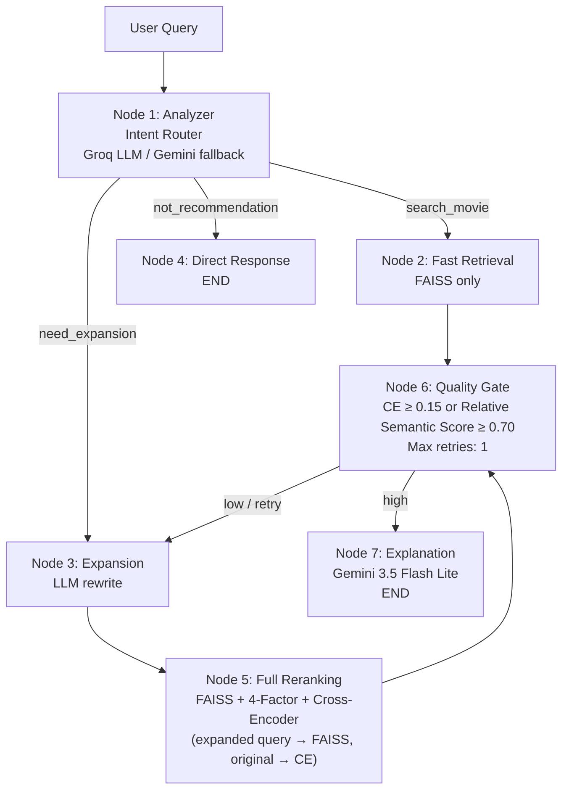

# RecSysLab: Agentic Movie Recommendation System with LangGraph

[](https://python.org)
[](https://fastapi.tiangolo.com)
[](https://python.langchain.com/docs/langgraph)
[](https://github.com/facebookresearch/faiss)
[](https://streamlit.io)

> **Applied AI Engineer Portfolio Project**
> An end-to-end agentic movie recommendation engine that uses a LangGraph state machine to route queries through intent classification, adaptive query expansion, FAISS retrieval, Cross-Encoder reranking, and self-correcting quality gates.

---

## 🚀 Key Features

* **Agentic LangGraph Pipeline**: Dynamically orchestrates recommendation logic (intent routing, adaptive query expansion, and self-correcting quality gates) rather than relying on a static linear pipeline.
* **Dual-Path Architecture**: Offers both a Fast Path (latency-optimized) and a Quality Path (LLM explanation-enhanced).
* **Four-Factor Hybrid Score Fusion**: Combines semantic similarity (`BAAI/bge-m3`), cross-encoder pairwise scoring (`BAAI/bge-reranker-v2-m3`), popularity metrics, and heuristic rule factors.
* **Human-Evaluated Benchmark**: Evaluated on 30 natural-language queries with graded relevance labels (0/1/2) and 100% Top-5 judgment coverage for both Agentic and Classic pipelines.

---

## 📊 Offline Evaluation & Accuracy Impact

Evaluated on a canonical benchmark suite of **30 human-labeled test queries** across **6 semantic categories** (Genre, Emotion, Negative Constraint, Multi-condition, Similar Movie, Natural Language).

### Benchmark Methodology
* **Evaluation Criteria**: 100% human-labeled coverage for Top-5 predictions from both pipelines. Relevance is graded strictly: 0 (Irrelevant), 1 (Relevant), 2 (Highly Relevant).
* **Strict Ranking Rules**: Rank-preserving evaluation ensures accurate real-world representation.
* **Novelty vs. Relevance**: Novelty is defined strictly as the percentage of Agentic recommendations that do not overlap with the Classic baseline's Top-5.
* *Note: Deeper ranking metrics (e.g., nDCG@10, MRR@10, HitRate@20) were not assessed in this v1 benchmark to maintain 100% dense labeling on the Top-5 cutoff.*

### Ranking Configurations
| Pathway / Baseline | Cross-Encoder | Semantic (BGE-M3) | Popularity | Heuristic Rule |
| :--- | :---: | :---: | :---: | :---: |
| **Classic Ablation Baseline** | 0.50 | 0.25 | 0.15 | 0.10 |
| **Agentic Quality Path** | 0.55 | 0.25 | 0.10 | 0.10 |
| **Agentic Fast Path** | N/A | 0.50 | 0.30 | 0.20 |

### Head-to-Head: Agentic vs Classic Pipeline
The production Agentic pipeline (Quality Path) was evaluated head-to-head against the Classic Ablation Baseline.

| Metric | Agentic | Classic Baseline | Improvement |
| :--- | :---: | :---: | :---: |
| **NDCG@5** | **`0.843`** | `0.809` | **+4.2%** |
| **Precision@5** | **`0.920`** | `0.913` | **+0.7%** |

### Benchmark Highlights
* **Per-Query Ranking Comparison**: Agentic achieved an 18 / 4 / 8 win / tie / loss record against the Classic baseline based on per-query nDCG@5.
* **High Novelty Discovery**: The Agentic pipeline's adaptive query expansion and dynamic routing allowed it to discover **60.7% novel recommendations** (91 out of 150 movies) that were entirely missed by the Classic pipeline's Top-5.

---

## 🏗️ System Architecture

The recommendation engine leverages a 7-node LangGraph state machine. *Note: LangGraph is used exclusively for pipeline orchestration, decision-making, and routing, not as a weight-tuning tool.*



---

## 🧪 Testing & Reliability

The repository is equipped with a robust test suite ensuring API contract adherence and production config validation.
* **18 non-slow unit/contract tests passed**; integration tests (e.g., end-to-end reproducibility) are opt-in and require local ML models and API credentials.

---

## ⚙️ Quick Start & Installation

### 1. Clone & Setup Environment

```bash
git clone https://github.com/Dave-Hoang/RecSysLab.git
cd RecSysLab

# Create virtual environment
python -m venv venv
source venv/bin/activate  # On Windows: venv\Scripts\activate

# Install dependencies
pip install -r requirements.txt
```

### 2. Configure Environment Variables

Create a `.env` file in the root directory (using the provided `.env.example` as a guide):

```env
GOOGLE_API_KEY=your_gemini_api_key_here
GROQ_API_KEY=your_groq_api_key_here
```

### 3. Build the Vector Index for End-to-End Recommendations
*Note: A clean clone verifies the installation and API functionality via mocked unit/contract tests without requiring the dataset. However, downloading the dataset and building the FAISS index is **REQUIRED** to run live recommendations using the FastAPI backend and Streamlit dashboard. The dataset and FAISS index are not tracked in Git due to their size (>1GB).*

1. Download the [MovieLens 32M dataset](https://grouplens.org/datasets/movielens/32m/) and extract the CSVs into `data/ml-32m/`.
2. Run the data pipeline to build the FAISS index:
   ```bash
   python data/scripts/build_processed_data.py
   python data/scripts/build_faiss_index.py
   ```

### 4. Launch Backend API & Frontend Dashboard

```bash
# Start FastAPI Backend API (Port 8000)
python -m uvicorn src.api.app:app --app-dir data --reload --port 8000

# Start Streamlit Web Dashboard (Port 8501)
streamlit run streamlit_app/app.py
```

Open `http://localhost:8501` in your browser to interact with the system!

---

## 🛡️ Security

**Security Recommendation**: It is highly recommended to configure a pre-commit secret scanner (e.g., [Gitleaks](https://github.com/gitleaks/gitleaks)) in your local environment before contributing. The repository is explicitly configured to ignore `.env` files—never commit your API keys.

## 📄 License & Contact

* **Author**: Applied AI Engineering Portfolio
* **License**: MIT License
